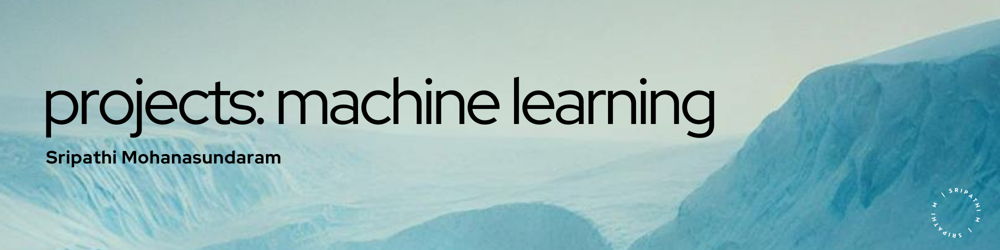

# Exploring the Frontier of Machine Learning Expertise
   

## Overview
Welcome to my distinguished repository of meticulously crafted machine learning projects. Each project encapsulates my dedication to harnessing advanced technology to drive innovation and solve complex challenges.

## Project Showcase

1. [Project 1: Detection of Conversion fraud in Digital Advertising](01.classification%20genuine%20and%20false%20conversions.ipynb)
     - Classification problem to distinguish between genuine and false conversions.
3. [Project 2: Connect 4 win or loss prediction](02.classification-connect4%20win%20orvloss%20prediction.ipynb)
     - Classification problem to determine whether the first player has won the game based on the given Connect-4 positions.
5. [Project 3: Phishing attack detection](03.classification-phising%20attack%20detection.ipynb)
     - Classification problem to detect phishing attacks.
7. [Project 4: Potential customer identification](04.classification-potential%20customer%20identification%20to%20cross%20sell%20credit%20card.ipynb)
     - Classification problem to identify potential customers for cross-selling credit cards.
9. [Project 5: Mortality rate prediction](05.regression-predict%20mortality%20rate.ipynb)
     - Regression problem to predict the mortality rate based on different symptoms and the patient’s condition.

## About

Delve into each project to explore how I have utilized cutting-edge algorithms and robust analytical techniques to distill complex data into actionable insights, demonstrating my profound understanding of the intricate landscape of machine learning.

## Usage

Feel free to peruse each project in detail, gaining valuable insights into the methodologies, datasets, and algorithms employed. Delve into the intricacies of the code, exemplifying my prowess in leveraging sophisticated analytical tools. Kindly consider showing your appreciation by starring the repository for the projects that resonate with your aspirations.

## Contact

For further discussions on potential collaborations or to gain deeper insights into my projects, please feel free to contact me via email at [3sripathi@gmail.com](mailto:3sripathi@gmail.com). Additionally, you can explore more of my in-depth analyses and observations on machine learning on my [Medium blog](https://medium.com/@3sripathi) or connect with me on [LinkedIn](https://www.linkedin.com/in/sripathi-mohanasundaram/).
